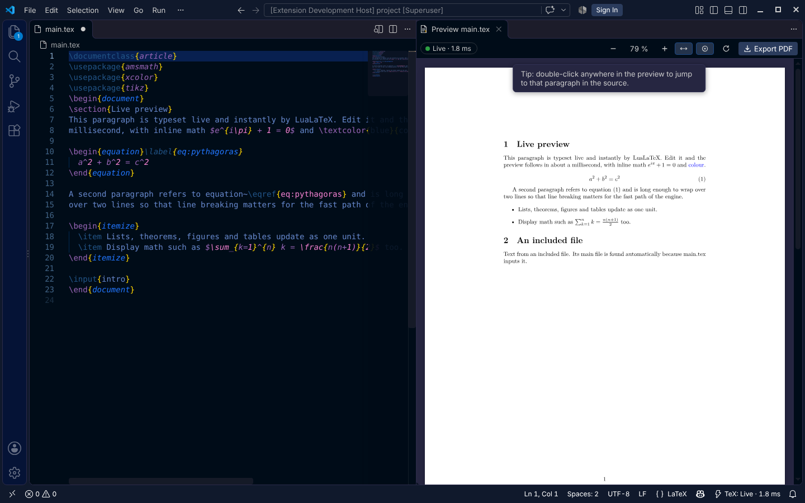

# Realtime TeX Live Preview

English | [简体中文](README.zh-CN.md)

A live LaTeX preview for VS Code that keeps up with your typing. It is built on
[realtime-tex (rtex)](https://github.com/HenryXiaoYang/realtime-tex), which keeps LuaTeX running and
re-typesets only the paragraph you are editing, in about a millisecond. Page breaks,
references and bibliographies follow from a full compile in the background.



## Quick start

1. Open a folder with a LaTeX project. On Linux or macOS it is used directly; on Windows, open the folder in WSL.
2. Open a `.tex` file and click the **preview icon** in the editor title bar, or press **Ctrl+Alt+V** (**Cmd+Alt+V** on Mac).
3. Start typing.

On first use, the preview walks you through anything that is missing:

- **rtex is not installed.** Click **Install rtex**. It is built from source with Rust's `cargo`, takes a few minutes, and only happens once.
- **LuaLaTeX was not found.** Choose your TeX Live `bin` folder, or let the extension install a minimal TeX Live 2026.

**Realtime TeX: Check Setup** in the command palette checks everything and offers a fix for each problem.

The extension keeps the rtex it installed up to date. It checks once a day and offers **Update Now**. **Realtime TeX: Update rtex Engine** updates on demand: it pulls the latest realtime-tex, rebuilds it and restarts the engine. The `realtimeTex.updateCheck` setting controls this.

## Using the preview

| | |
|---|---|
| **Toolbar** | Status pill · zoom − / + · **Fit width** · **Follow cursor** · **Recompile** · **Export PDF** |
| **Status pill** | **Live · 0.8 ms** means the paragraph was re-typeset that fast. **Updating layout…** means a full compile is placing pages, references and floats. **Up to date** means everything matches. **N errors** opens the Problems panel. |
| **Live markers** | A bar next to the line numbers shows how each part of your source updates: **solid green** updates live as you type, **dotted amber** waits for the full compile (the preamble, TikZ, …). Hover over a part that went to the full compile to see why. |
| **Follow cursor** | The preview scrolls to the paragraph you are editing. **Ctrl+Alt+J** jumps there on demand. |
| **Jump to source** | Double-click (or Ctrl/Cmd+click) a paragraph in the preview. |
| **Zoom** | Ctrl + mouse wheel, Ctrl + = / − / 0 |
| **Export PDF** | **Ctrl+Alt+E**. Writes `main.pdf` next to the main file. The result matches a clean LuaLaTeX build. |
| **Errors** | LaTeX errors and warnings appear in the Problems panel and as squiggles. |

The **main file** is found automatically. The extension looks for, in order:

1. a `% !TEX root = main.tex` comment;
2. the file with `\documentclass`;
3. the file that `\input`s or `\include`s the one you are editing.

If it is ambiguous, the preview asks you to choose. The choice is saved in `realtimeTex.mainFile`.

### What updates instantly

Body text, inline and display math, `\ref`/`\eqref`/`\cite` (with the numbers from the last
full compile), lists, theorems, figures and tables (content), and headings all update with each
keystroke. Everything else updates with the next full compile, typically a second or two later:

- preamble changes;
- TikZ;
- moved floats;
- footnote text at the bottom of the page;
- new page breaks.

The pill says when this is happening. See rtex's
[limitations](https://github.com/HenryXiaoYang/realtime-tex/blob/main/docs/LIMITATIONS.md) for details.

For the fastest updates, use TFM fonts (the default, `lmodern`, …) or OpenType fonts loaded with
`Renderer=Basic`. fontspec's default node mode works, but each keystroke takes longer.

### How pages are drawn

The preview draws rtex's display lists itself, so a keystroke repaints a single paragraph without a
PDF round trip. It supports:

- OpenType/TrueType fonts, by glyph index;
- Type1 fonts, such as Computer Modern math and `lmodern`, found through TeX's `pdftex.map`;
- colors, rules, PNG/JPEG/PDF images and graphicx scaling.

Some pages cannot be drawn this way, for example TikZ drawings or `\special`s. Those are shown
from the background PDF, marked with a small **from PDF** badge, and edits on them still appear
live on top.

## Settings

| Setting | Default | |
|---|---|---|
| `realtimeTex.serverPath` | *(auto)* | rtex binary. Empty means the one installed by **Install rtex**, then `rtex` on `PATH`. |
| `realtimeTex.texliveBin` | *(PATH)* | Folder containing `lualatex`. |
| `realtimeTex.texDir` | *(auto)* | rtex's `tex/` folder. Only needed if you moved the binary away from its checkout. |
| `realtimeTex.updateCheck` | `notify` | Once a day, check realtime-tex `main` for a newer engine: `notify` offers the update, `auto` updates and rebuilds by itself, `off` never checks. The setting has an **Update rtex now** link. |
| `realtimeTex.engine.eligibility` | `probe` | How rtex picks the parts that update live: `probe` (compare a live result with the last full compile) or `allowlist` (only known-safe commands). |
| `realtimeTex.engine.fastBudgetMs` | `5` | Time budget for re-typesetting one part live; a part that takes longer three times in a row waits for the full compile. |
| `realtimeTex.engine.pictureCache` | `true` | Reuse unchanged TikZ pictures from the previous full compile. |
| `realtimeTex.debug.enabled` | `false` | rtex saves a debug bundle (source, context, trace, TeX log) whenever the live engine hangs or crashes, and lists every live compile in `requests.log`. **Open Debug Folder** shows them. |
| `realtimeTex.debug.directory` | *(storage)* | Where debug bundles go. |
| `realtimeTex.mainFile` | *(auto)* | Main file, relative to the workspace folder. |
| `realtimeTex.buildDir` | *(storage)* | Where rtex keeps build files. Empty keeps them out of your project. |
| `realtimeTex.exportPath` | `${mainDir}/${mainName}.pdf` | Where **Export PDF** writes. |
| `realtimeTex.syncCursor` | `true` | Preview follows the cursor. |
| `realtimeTex.editor.liveMarkers` | `true` | Live/full-compile bars next to the line numbers. |
| `realtimeTex.autoStart` | `false` | Start the engine when a LaTeX file opens, without waiting for the preview. |
| `realtimeTex.stopWhenPreviewCloses` | `true` | Stop the engine when the preview closes. |
| `realtimeTex.preview.zoom` | `fitWidth` | Initial zoom. |
| `realtimeTex.preview.invertInDarkTheme` | `false` | Dark pages in dark themes. |

## Commands

All commands are under **Realtime TeX:** in the command palette:

- **Open Live Preview to the Side**
- **Export PDF**
- **Recompile Whole Document**
- **Show Cursor Position in Preview**
- **Restart Engine**
- **Stop Engine**
- **Show Log**
- **Open Debug Folder**
- **Check Setup**
- **Install rtex (Build from Source)**
- **Update rtex Engine**
- **Locate rtex Binary…**
- **Choose Main File…**
- **Get Started**

## Development

```bash
npm install
npm run build        # dist/extension.js, dist/webview.js
npm test             # unit tests (node:test)
npm run typecheck
npm run package      # .vsix
```

Press F5 in VS Code to start an Extension Development Host.

The integration suite drives a real VS Code with the real engine. It needs a built rtex and
TeX Live:

```bash
RTEX_E2E_SERVER=/path/to/realtime-tex/target/release/rtex \
RTEX_E2E_TEXLIVE_BIN=/path/to/texlive/2026/bin/x86_64-linux \
xvfb-run -a npm run test:e2e
```

### Layout

| Path | |
|---|---|
| `src/extension.ts` | Activation, commands, main-file resolution, editor events |
| `src/session.ts` | One `rtex serve` session: buffer sync, events → diagnostics/status/preview, export, source ↔ preview mapping |
| `src/rtexProcess.ts` | The `rtex serve` JSON-lines child process |
| `src/edits.ts` | VS Code changes (UTF-16) → rtex byte edits (UTF-8) |
| `src/resources.ts`, `src/type1.ts` | Font and image loading; Type1 fonts and `pdftex.map` → glyph outlines |
| `src/gutter.ts`, `src/liveMarks.ts` | The live/full-compile markers next to the line numbers |
| `src/preview/panel.ts` | The webview panel and its message protocol |
| `src/setup.ts`, `src/config.ts` | Setup check, rtex/TeX Live installation, settings |
| `webview/` | The preview: page/overlay model, canvas renderer, pdf.js fallback, toolbar |

## License

MIT
